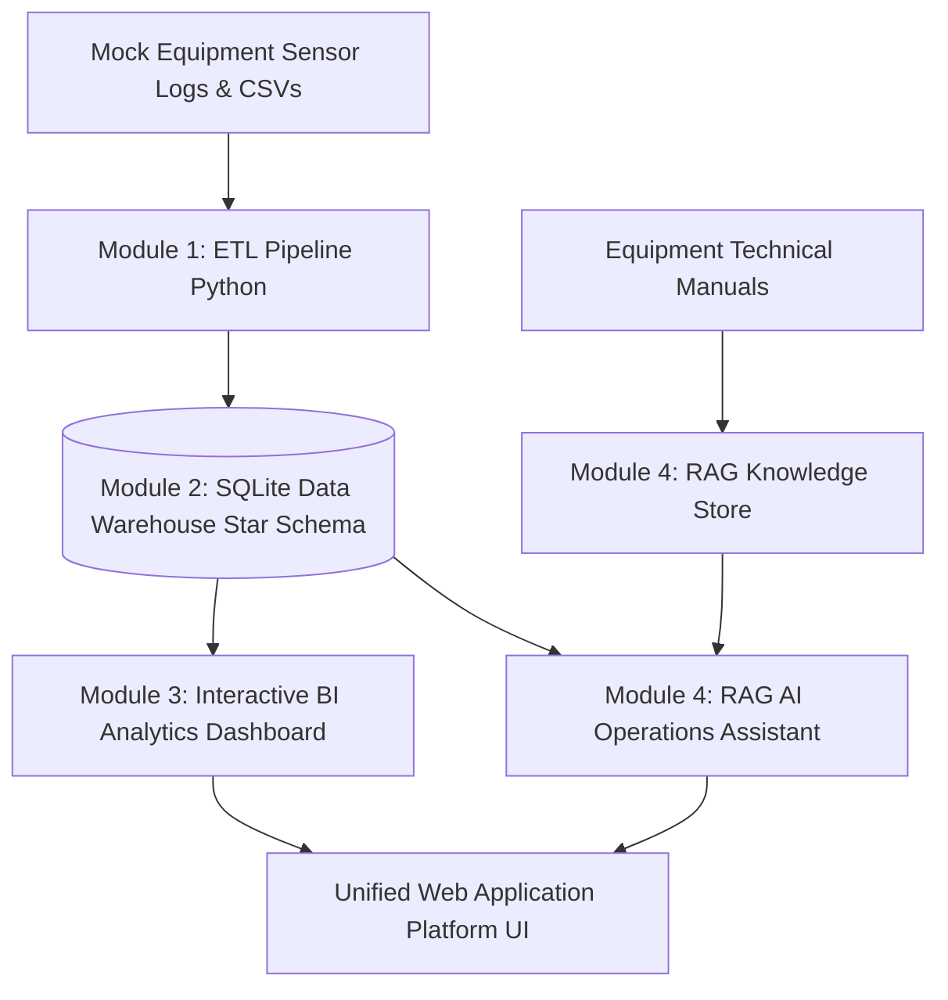

# Smart Factory Equipment Maintenance & Data Platform 🏭⚡

> **End-to-End AI-Assisted Operations & Data Engineering Infrastructure**  
> *Prepared for Meiden Engineering Corporation & Meidensha Corporation DX Promotion & Data Infrastructure Applications.*

---

## 📌 Project Overview & Concept

This project mirrors the internal **Factory DX (Digital Transformation)** and **AI-assisted operations initiatives** built at Meiden Engineering and Meidensha Corporation. It implements a complete 4-module data pipeline:
1. **Raw Sensor & Maintenance Data Ingestion (ETL)**
2. **Relational Data Warehouse & Star Schema Modeling (SQLite)**
3. **Executive BI Dashboard & Predictive Maintenance Analytics**
4. **AI / RAG Maintenance Assistant** (Answering natural language queries across equipment manuals and database history)

---

## 🎯 Target Roles Covered

| Company | Target Role | Key Modules Demonstrated |
| :--- | :--- | :--- |
| **Meiden Engineering Corporation** | IT Engineer (DX Promotion Office) | Module 4 (RAG Chatbot, AI & Manuals Integration) |
| **Meidensha Corporation** | Data Engineer (Factory Digitalization / Data Infrastructure) | Module 1 & 2 (ETL Pipeline, Star Schema, SQLite) |
| **Meidensha Corporation** | Data Engineer (BI & Data Utilization Promotion) | Module 2 & 3 (Star Schema, ER Diagram, BI Visualizations) |

---

## 🏗️ Architecture & 4 Core Modules



### Module 1 — Data Ingestion & ETL
- **Python ETL Pipeline** (`etl/etl_pipeline.py`) extracts raw telemetry logs (`sensor_logs.csv`) and maintenance event records (`maintenance_logs.csv`).
- Data cleaning, datetime normalization, missing value handling, and transformation into dimensional star schema format.

### Module 2 — Data Warehouse & Star Schema Modeling
- **Relational Storage**: Embedded high-performance SQLite database (`factory_maintenance.db`).
- **Star Schema Structure**:
  - `fact_maintenance_events` (Fact Table: downtime hours, repair cost, defect flag, technician, description)
  - `fact_sensor_telemetry` (Fact Table: temperature, vibration, pressure, runtime hours)
  - `dim_equipment` (Equipment Specs: M-101, M-102, M-201, M-202, M-301)
  - `dim_location` (Plant Alpha/Beta, Sectors A-D)
  - `dim_technician` (Senior Electrical, Mechanical, Vibration Analysts)
  - `dim_date` (Date breakdown: Year, Quarter, Month, Day)
- Full ER Diagram available in [`docs/ER_DIAGRAM.md`](docs/ER_DIAGRAM.md).

### Module 3 — Interactive BI Analytics Dashboard
- Web-based BI analytics dashboard (`http://localhost:8000`) built with modern styling (dark mode, glassmorphism, responsive grid, dynamic Chart.js animations).
- Metrics tracked:
  - **Downtime Trends by Machine**
  - **MTTR (Mean Time To Repair)**
  - **Defect Sample & Temperature Distribution**
  - **Predictive Maintenance Service Windows** (Immediate / Schedule / Nominal)

### Module 4 — AI / RAG Maintenance Assistant & Access Control Security
- Conversational RAG engine (`backend/rag_engine.py`) integrating technical equipment manuals (`data/manuals/`) with historical SQL maintenance logs.
- **Information Security Access Control**: Implements API key authentication middleware (`X-API-Key: meiden-dx-secret-key`) for secure cloud & REST endpoint access.
- Allows natural-language queries:
  - *"When was Machine 102 last serviced?"*
  - *"What is the procedure for high bearing vibration in motor M-201?"*
  - *"How to replace transformer oil fan relay?"*

---

## 💻 Quick Start & Running Locally

### Prerequisites
- Python 3.9 or higher installed.

### 1. Clone & Setup
```bash
git clone https://github.com/YourUsername/Smart-Factory-Maintenance-Platform.git
cd Smart-Factory-Maintenance-Platform
```

### 2. Run ETL Pipeline
Extract raw CSV files and load data into SQLite Star Schema:
```bash
python etl/etl_pipeline.py
```

### 3. Launch Web Server & Dashboard
Start the HTTP server on port 8000:
```bash
python backend/server.py 8000
```

### 4. Open in Browser
Visit **`http://localhost:8000`** in your browser.

---

## 🐳 Docker Deployment (AWS / OCI Free Tier)

To deploy with Docker:

```bash
docker-compose up --build
```
The application will be accessible on port `8000`.

---
