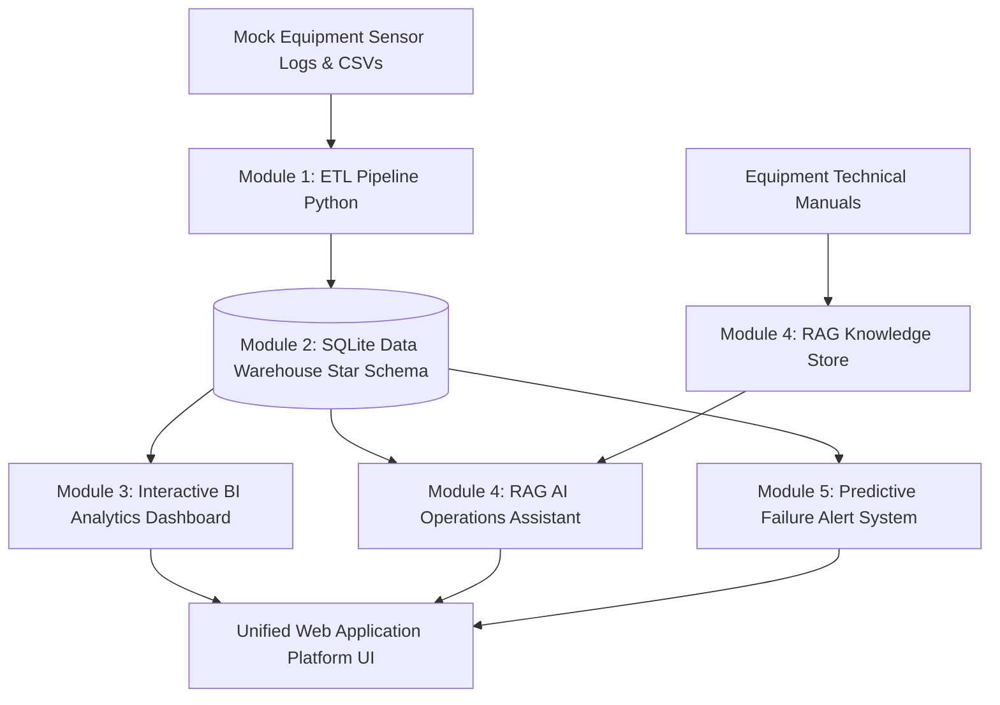

# AI-Assisted Equipment Maintenance System

> **A combined project idea for Meiden Engineering Corporation & Meidensha Corporation applications**  
> *End-to-End AI-Assisted Operations & Data Engineering Infrastructure*

---

## Concept

A mini end-to-end pipeline that ingests equipment sensor and maintenance data, stores it in a proper database, visualizes it via a BI dashboard, and adds an AI/RAG chatbot on top for querying maintenance manuals and equipment history. This mirrors exactly what both companies are building internally as part of their factory DX and AI-assisted operations initiatives.

---

## Target Roles Covered

| Company | Role |
| :--- | :--- |
| **Meiden Engineering Corporation** | IT Engineer (DX Promotion Office) |
| **Meidensha Corporation** | Data Engineer (Factory Digitalization / Data Infrastructure) |
| **Meidensha Corporation** | Data Engineer (BI & Data Utilization Promotion) |

---

## Architecture — 5 Core Modules



### Module 1 — Data Ingestion & ETL
*Maps to: Data Engineer, Factory Digitalization (Meidensha)*
- **Python ETL Pipeline** (`etl/etl_pipeline.py`) pulls mock equipment sensor logs (`sensor_logs.csv`) and maintenance event records (`maintenance_logs.csv`).
- Data cleaning, datetime normalization, missing value handling, and transformation into dimensional star schema format.
- Demonstrates ETL and database-building skills exactly as required in the job description.

### Module 2 — Data Warehouse & Modeling
*Maps to: Data Engineer, BI & Data Utilization Promotion (Meidensha)*
- **Relational Storage**: Embedded high-performance SQLite database (`factory_maintenance.db`).
- **Star Schema Structure**:
  - `fact_maintenance_events` (Fact Table: downtime hours, repair cost, defect flag, technician, description)
  - `fact_sensor_telemetry` (Fact Table: temperature, vibration, pressure, runtime hours)
  - `dim_equipment` (Equipment Specs: M-101, M-102, M-201, M-202, M-301)
  - `dim_location` (Plant Alpha/Beta, Sectors A-D)
  - `dim_technician` (Senior Electrical, Mechanical, Vibration Analysts)
  - `dim_date` (Date breakdown: Year, Quarter, Month, Day)
- Full ER Diagram available in [`docs/ER_DIAGRAM.md`](docs/ER_DIAGRAM.md) — a directly requested skill in the posting.

### Module 3 — BI Dashboard
*Maps to: Both Data Engineer roles (Meidensha)*
- Connects database telemetry to interactive web dashboard (`http://localhost:8000`) built with modern styling (dark mode, glassmorphism, responsive grid, dynamic Chart.js animations).
- Metrics tracked:
  - **Downtime Trends by Machine**
  - **MTTR (Mean Time To Repair)**
  - **Defect Sample & Temperature Distribution**
  - **Predictive Maintenance Service Windows** (Immediate / Schedule / Nominal)
- Demonstrates BI creation and data utilization for non-technical stakeholders such as factory managers.

### Module 4 — AI / RAG Assistant & Security
*Maps to: IT Engineer, DX Promotion Office (Meiden Engineering)*
- Build a RAG chatbot (`backend/rag_engine.py`) answering natural-language questions such as *"When was Machine 102 last serviced?"* or *"What is the procedure for high bearing vibration in motor M-201?"*
- Feeds mock equipment manuals (`data/manuals/`) plus the maintenance database as knowledge sources.
- Deployable on AWS or OCI free tier, with basic access control (`X-API-Key: factory-dx-secret-key`) — covers AI/RAG, cloud, and information security requirements.

### Module 5 — Predictive Failure Alert System (Standout Feature)
*Maps to: All three roles — the feature that bridges data engineering, BI, and AI/RAG*
- Instead of only reporting what already happened (downtime logs, defect history), this feature predicts when a machine is likely to fail before it happens, using runtime hours, temperature trends, and past failure patterns.
- Triggers an automatic alert recommending maintenance before a breakdown occurs — shifting the system from reactive to preventive maintenance.
- Directly reflects Meiden Engineering's core mission of *"extending the service life of facilities"*.
- Bridges the data/BI side (Meidensha) and the AI side (Meiden Engineering) in a single feature.
- Simple to build yet demo-friendly: a dashboard where each machine shows a red / yellow / green health status based on predicted risk.
- Can start as a rule-based threshold model (e.g., flag high risk if runtime hours + temperature deviation exceed a set limit), then optionally upgraded to a basic ML model such as logistic regression or a decision tree trained on labeled failure data.

> **One-line pitch**: *"The system doesn't just track maintenance history — it predicts equipment failure risk in advance and proactively alerts technicians, turning reactive maintenance into preventive maintenance."*

---

## Why This Works

- **Single Cohesive Narrative**: A small-scale version of what the DX Promotion team and the factory data team are actually trying to build — from raw equipment data to an AI assistant that helps technicians and managers use that data.
- **Versatile Interview Demo**: It can be demoed once but discussed differently depending on the interview — lead with Module 4 for the Meiden Engineering IT role, and lead with Modules 1–3 for the Meidensha Data Engineer roles.
- **Complete Skill Coverage**: It naturally covers nearly every required and preferred skill across all three job descriptions: Python, SQL, AWS, BI tools, ER diagrams, ETL, RAG / generative AI, and basic cloud security.

---

## Quick Start & Running Locally

### Prerequisites
- Python 3.9 or higher installed.

### 1. Clone & Setup
```bash
git clone https://github.com/ManasviBhandary/AI-Assisted-Equipment-Maintenance-System-project-.git
cd AI-Assisted-Equipment-Maintenance-System-project-
```

### 2. Run ETL Pipeline
Extract raw CSV files and load data into SQLite Star Schema:
```bash
python etl/etl_pipeline.py
```

### 3. Launch Web Server & Dashboard
Start the HTTP server on port 8000:
```bash
python backend/server.py 8000
```

### 4. Open in Browser
Visit **`http://localhost:8000`** in your browser.

---

## Docker Deployment (AWS / OCI Free Tier)

To deploy with Docker:

```bash
docker-compose up --build
```
The application will be accessible on port `8000`.

---

## License & Overview
Open source project for smart factory data engineering and AI operations demonstration. Prepared as an interview-preparation reference for Meiden Engineering Corporation and Meidensha Corporation applications.

