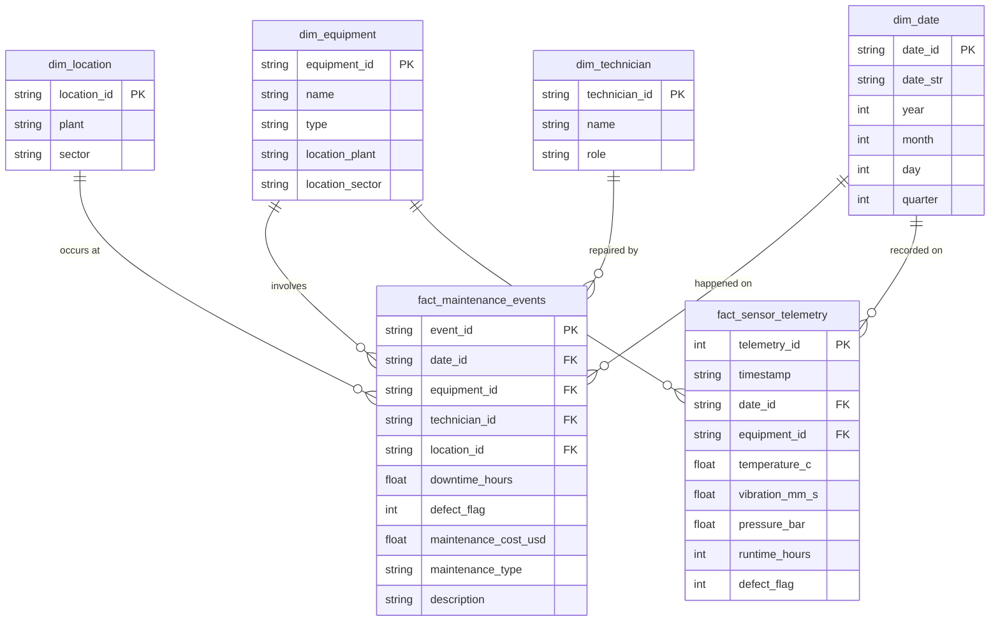

# Smart Factory Equipment Maintenance Data Warehouse Architecture
**Entity-Relationship (ER) Diagram & Dimensional Data Modeling Documentation**
*Smart Factory DX Promotion & Infrastructure Reference*

## 1. Overview & Data Modeling Strategy
The data platform utilizes a **Dimensional Star Schema** design optimized for Business Intelligence (BI) analytical queries, downtime trends reporting, and AI/RAG query retrieval.

- **Fact Tables**: Contain quantitative measurements (sensor telemetry readings, downtime hours, repair costs, defect flags).
- **Dimension Tables**: Provide context (equipment specifications, geographic plant/sector locations, technician qualifications, date attributes).

---

## 2. Entity-Relationship (ER) Star Schema Diagram

---

## 3. Data Dictionary

### Fact Table: `fact_maintenance_events`
- `event_id` (VARCHAR PK): Unique identifier for each maintenance incident.
- `date_id` (VARCHAR FK): Foreign key referencing `dim_date`.
- `equipment_id` (VARCHAR FK): Foreign key referencing `dim_equipment`.
- `technician_id` (VARCHAR FK): Foreign key referencing `dim_technician`.
- `location_id` (VARCHAR FK): Foreign key referencing `dim_location`.
- `downtime_hours` (DECIMAL): Equipment operational downtime in hours.
- `defect_flag` (TINYINT): Binary indicator (1 = Unplanned defect/breakdown, 0 = Planned maintenance).
- `maintenance_cost_usd` (DECIMAL): Total parts and labor cost in USD.
- `maintenance_type` (VARCHAR): Classification ('Corrective' vs 'Preventive').
- `description` (TEXT): Free-text technician repair notes (embedded into RAG AI search).

### Fact Table: `fact_sensor_telemetry`
- `telemetry_id` (INTEGER PK): Auto-increment primary key.
- `timestamp` (DATETIME): High-frequency sensor sample timestamp.
- `temperature_c` (FLOAT): Bearing or winding temperature in Celsius.
- `vibration_mm_s` (FLOAT): RMS vibration velocity in mm/s.
- `pressure_bar` (FLOAT): Operating pressure in Bar.
- `runtime_hours` (INTEGER): Cumulative machine operating hours.

---

## 4. Key Analytical Metrics Computed
1. **MTTR (Mean Time To Repair)** = $\frac{\sum \text{Downtime Hours}}{\text{Total Breakdown Count}}$
2. **Defect Rate by Machine** = $\frac{\text{Defect Incidents}}{\text{Total Operational Cycles}}$
3. **Cumulative Maintenance Cost** = $\sum \text{maintenance\_cost\_usd}$
